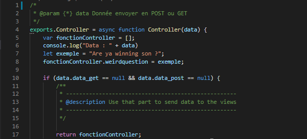
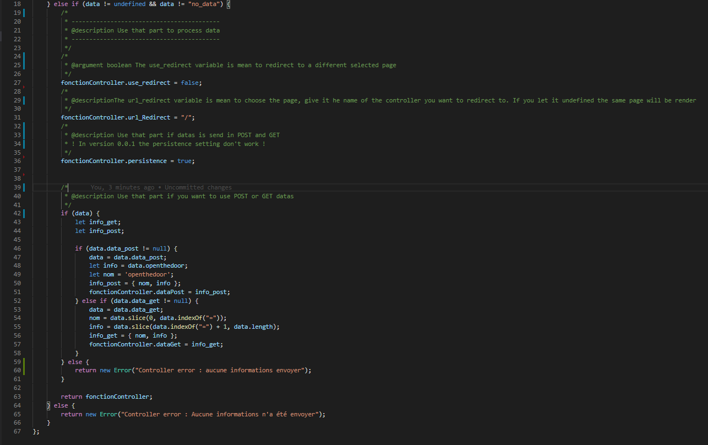
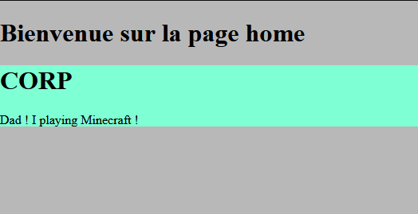
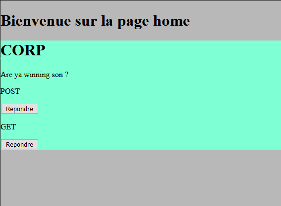
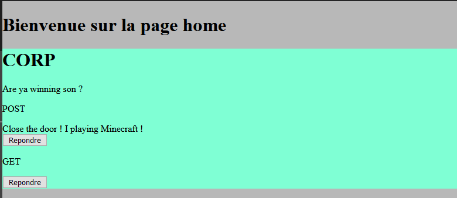
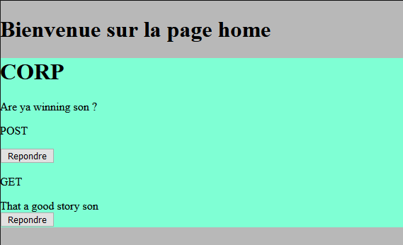

## FR Version

# NodeJS Serveur
Serveur basic Node JS Utilisant ExpresseJS
# Première version de RapideNodeJS utilisant ExpressJS
Version actuelle 0.0.1

# Possiblité de RapideNodeJS :
RapideNodeJS est juste un serveur basique utilisant Node JS.
Il est avantageux pour quiconque voudrait créer rapidement une page ou bien voudrait un support de départ pour son propre serveur NodeJS.
Il n'est pas recommandé de l'utiliser comme serveur de Prod mais seulement de Dev.

## Package utiliser
* body-parser
* express
* child_process
* ejs
## Package conseiler
* Nodemon
* favicon
* fs-extra
* mocha

## Qu'est t'il possible de faire avec RapideNodeJS ?
* Créer un site en utilisant le model MVC.
* Créer rapidement une page son css ainsi que son contrôleur grâce à l'utilitaire *Teta.
* Choisir l'url que l'on veut pour sa page ou même en mettre plusieurs.

## Comment le lancer ?
Si vous avez Node JS installer sur votre système il vous suffit de lancer cette commande
#### CMD
```
Laucher
```
#### Powershell
```
.\Laucher
```
Une fois cela fait ouvrir votre navigateur et aller a l'addresse `localhost:4444`

--------------
## Les utilitaires en commande prompt

Teta est l'utilitaire qui vous permet de générer les fichiers tels que le contrôleur, la vue, le css et de choisir l'url attribuée à la page.
Il s'ouvre simplement en double cliquant dessus ou en tapant son nom dans un CMD : Teta ou .\Teta via powershell
(n'oubliez pas de vous situer dans le dossier principal pour le lancer).
#### CMD
```
Teta
```
#### Powershell
```
.\Teta
```
## Commande utilisable
---------------------------
Création d'une nouvelle page
```
np
```
ou
```
New Page
```
Vous permet de générer le contrôleur, la vue, le css
vous avez deux options. 
* Default <br />
Vous donnez un nom et il sera attribué à tout les fichiers ainsi qu'à l'url.
* Personnaliser <br />
Vous pourrez choisir le nom du contrôleur, de la vue et du css ainsi que des ou de l'url.

L'aide affichant toutes les commandes disponibles.
```
help
```
Vous permet de quitter l'inviter de commande
```
exit
```
## Fonctionnement de RapidNodeJS
Par défaut le contrôleur fonctionne comme un énorme tableau, 
toutes les données peuvent donc être envoyées dans un tableau typé, un tableau normal, ou une seule variable, 
tout dépend de comment vous voulez le traiter dans votre vue.

Exemple : 
### Contrôleur
 <br />
Dans le controller la variable ```fonctionController``` est un tableau dans lequel devra être mise chacune des variables
qui devra être envoyée à la vue.  <br />
Le premier `if` gère les informations envoyées à la vue et le deuxième lui gère la récupération des informations. <br />
 <br />
Dans la deuxième image du contrôleur on traite les informations renvoyées par la page. <br />
Les informations sont envoyées sous cette forme : `datas = { data_get, data_post };` <br />
Les données sont donc accessibles comme suit : <br />
Pour le POST : `data.data_post`<br />
Pour le GET : `data.data_get`<br />
### Vue
 <br />
Comme on le peut le voir la variable `weirdquestion` est accessible par la variable `Controller` dans la vue. <br />
### Navigateur
 <br />
La variable s'affiche bien sur le navigateur. <br />
Bien et maintenant quand une variable est passée en GET ou POST ? <br />
 <br />
On peut voir que la variable s'affiche bien grâce à `Controller.dataPost.info` Note : `dataPost` est le nom de la variable définie dans le contrôleur <br />
 <br />
On peut voir que la variable s'affiche bien grâce à `Controller.Get.info` Note : `dataGet` est le nom de la variable définie dans le contrôleur. <br />

* Note : ce projet est toujours en cours à l'heure qu'il est 27/09/2020

## EN Version

# NodeJS server
Basic JS Node Server Using ExpresseJS
# First version of RapideNodeJS using ExpressJS
Current version 0.0.1

# Possibility of RapideNodeJS:
RapideNodeJS is just a basic server using Node JS.
It is advantageous for those who would like to quickly create a page or would like a starting support for their own NodeJS server.
It is not recommended to use it as a Prod server, only a Dev server.

## Package use
* body analyzer
* Express
* child_process
* ejs
## Adviser package
* Nodemon
* favicon
* fs-extra
* Mocha

## What can I do with RapideNodeJS?
* Create a site using the MVC template.
* Quickly create a page its css as well as its controller thanks to the utility * Teta.
* Choose the url you want for your page or even put several.

## How to launch it?
If you have Node JS installed on your system just run this command
#### CMD
`
Launcher
`
#### Powershell
``
.\Laucher
``
Once done open your browser and go to the address `localhost: 4444`

--------------
## Prompt command utilities

Teta is the utility that allows you to generate the files such as controller, view, css and choose the url assigned to the page.
It simply opens by double clicking on it or typing its name in a CMD: Teta or. \ Teta via powershell
(don't forget to be in the main folder to launch it).
#### CMD
`
Teta
`
#### Powershell
`
.\Teta
`
## Usable command
---------------------------
Creating a new page
`
np
`
or
`
New page
`
Allows you to generate controller, view, css
you have two options.
* Default <br />
You give a name and it will be assigned to all the files as well as to the url.
* Customize <br />
You can choose the name of the controller, the view and the css as well as the or the url.

Help displays all available commands.
`
Help me
`
Allows you to exit the command prompt
`
exit
`
## How RapidNodeJS works
By default the controller works like a huge board,
all the data can therefore be sent in a typed array, a normal array, or a single variable,
it all depends on how you want to use it in the view.

Example:
### Controller
 <br />
In the controller the variable `functionController` is an array in which the variables must be set up
which will need to be sent to the view. <br />
The first "if" manages the information sent to the view and the second manages the retrieval of the information. <br />
 <br />
In the second image of the controller, the information returned by the page is processed. <br />
The information is sent in this form: `datas = {data_get, data_post};` <br />
The data can therefore be accessed as follows: <br />
For POST: `data.data_post` <br />
For the GET: `data.data_get` <br />
### View
 <br />
As we can see, the variable `weirdquestion` is accessible by the variable` Controller` in the view. <br />
### Navigator
 <br />
The variable is displayed in the browser. <br />
Okay, now when a variable is passed to GET or POST? <br />
 <br />
We can see that the variable is displayed well thanks to `Controller.dataPost.info` Note:` dataPost` is the name of the variable broadcast in the controller <br />
 <br />
We can see that the variable is displayed well thanks to `Controller.Get.info` Note:` dataGet` is the name of the variable broadcast in the controller. <br />

* Note: this project is still in progress as of 09/27/2020
