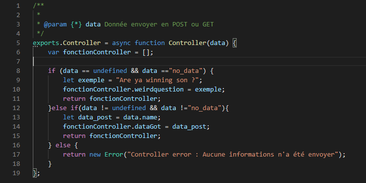

FR Version
# NodeJS Serveur
Serveur basic Node JS Utilisant ExpresseJS
# Première version de RapideNodeJS utilisant ExpressJS
Version actuelle 0.0.1

# Possiblité de RapideNodeJS :
RapideNodeJS est juste un serveur basique utilisant Node JS.
Il est avantageux pour quiconque voudrait créer rapidement qu'elle page ou bien voudrait un support de départ pour son propre serveur NodeJS.
Il n'est pas recommander de l'utiliser comme serveur de Prod mais seulement de Dev.

## Package utiliser
* body-parser
* child_process
* ejs
* express
* favicon
* fs-extra
* mocha

## Quelle t'il possible de faire avec RapideNodeJS ?
* Créer un site en utilisant le model MVC.
* Créer rapidement une page son css ainsi que son controller grâce au l'utilitaire Teta.
 *Choisir l'url que l'on veut pour sa page ou même en mettre plusieurs.

Teta est l'utilitaire qui vous permet de générer les fichiers t'elle que le controller, la vue, le css et de choisir l'url attribuer a la page.
Il s'ouvre simplement en double cliquant dessus ou en tapant son nom dans un CMD : Teta ou .\Teta via powershell
(n'oublier pas de vous situer dans le dossier principale pour le lancer).

## Commande utilisable
* np ou New Page
Vous permet de générer le controller, la vue, le css
vous avez deux options. 
1°) Default
 * Vous donner un nom et il sera attribuer a tout les fichiers ainsi qu'a l'url.
2°) personnaliser
 * Vous pourrez choisir le nom du controller, de la vue et du css ainsi que des ou de l'url.
 
## Logique de la chose
Le controller fonctionne comme un énorme tableaux.
Exemple : 
### Controller

### Vue

 /*
 *Note : ce projet est toujours en cour a l'heure qu'il est 27/09/2020
 */
 
 EN Version
 
# NodeJS Server
Basic JS Node Server Using ExpresseJS
# First version of RapideNodeJS using ExpressJS
Current version 0.0.1

# Possibility of RapideNodeJS:
RapideNodeJS is just a basic server using Node JS.
It is beneficial for anyone who would like to quickly create their own page or would like some starter support for their own NodeJS server.
It is not recommended to use it as Prod server but only Dev server.

## Package use
* body-parser
* child_process
* ejs
* express
* favicon
* fs-extra
* mocha

## What can you do with RapideNodeJS?
* Create a site using the MVC model.
* Quickly create a page its css as well as its controller thanks to the utility Teta.
* Choose the url you want for your page or even put several.

Teta is the utility which allows you to generate files like the controller, view, css and choose the url to assign to the page.
It simply opens by double clicking on it or typing its name in a CMD: Teta or. \ Teta via powershell
(don't forget to be in the main folder to launch it).

## Command usable
* np or New Page
Allows you to generate the controller, view, css
you have two options.
1 °) Default
 * Give you a name and it will be assigned to all the files as well as to the url.
2 °) customize
 * You will be able to choose the name of the controller, the view and the css as well as the or the url.
 
 /*
 *Note: this project is still in progress at the time it is 27/09/2020
 */
